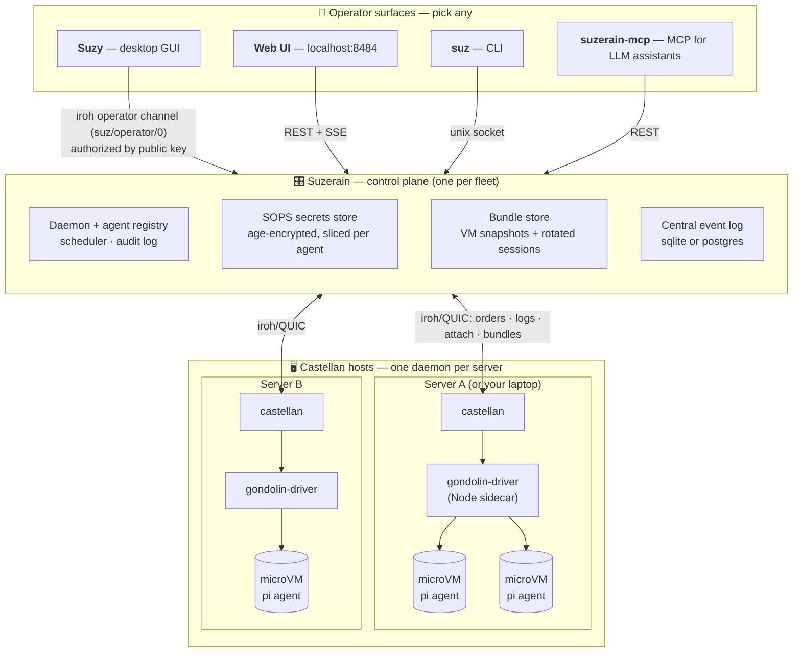
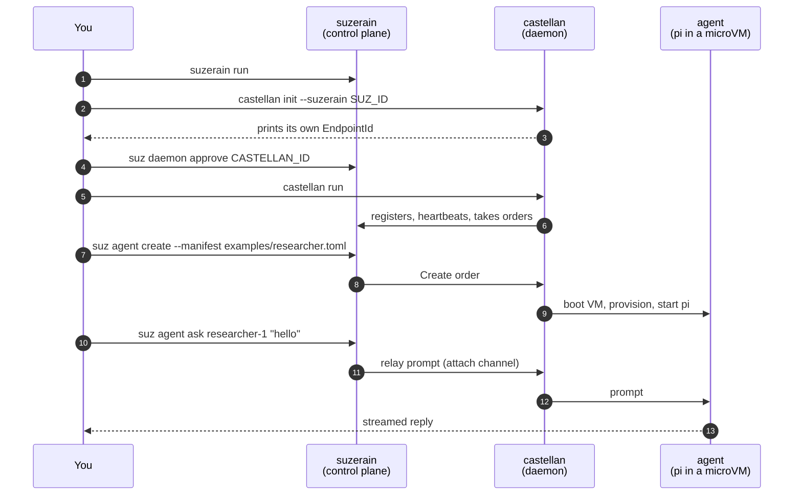
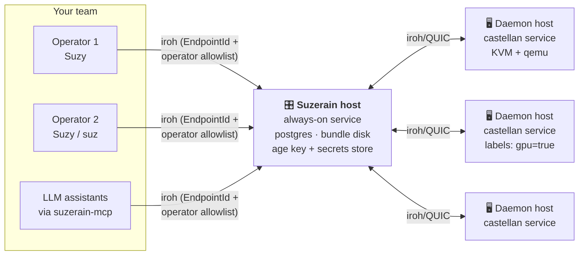
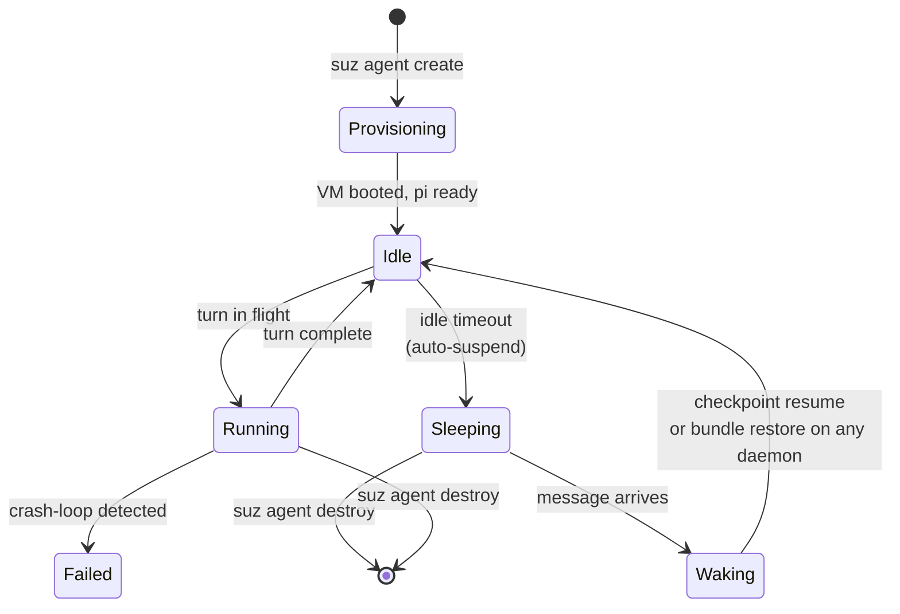

# suzerain

**A fleet manager for AI coding agents.** Run many isolated, long-lived
agents — each [Pi](https://github.com/earendil-works/pi) agent in RPC mode
inside its own **Gondolin microVM** — across as many servers as you have,
with one control plane, one CLI, one web UI, one desktop app, and one
secrets store.

Agents are declared as TOML manifests, scheduled onto machines, and
**automatically suspended when idle and woken when a message arrives** —
so a fleet of 50 agents costs the compute of the ones actually working.

## The three subsystems

| Piece | What it is | Read more |
|---|---|---|
| **Suzerain** | The control plane (one per fleet). Registry, scheduler, secrets store, central event log, web UI + REST API. | [docs/PLAN.md](docs/PLAN.md) |
| **Castellan** | The agent daemon (one per server). Boots Gondolin microVMs, provisions and supervises agents, ships logs home. | [docs/PLAN.md](docs/PLAN.md) §6 |
| **Suzy** | The desktop GUI (egui). Connects from anywhere over iroh — chat with agents, watch the fleet, open shells into VMs. | [docs/SUZY.md](docs/SUZY.md) |

Plus supporting cast: **`suz`** (operator CLI), **`suzerain-mcp`** (MCP
server so your local LLM assistant can run the fleet —
[docs/MCP.md](docs/MCP.md)), and a built-in **web UI** on
`http://127.0.0.1:8484` ([docs/WEB-UI.md](docs/WEB-UI.md)).

## How it fits together



Everything node-to-node runs over **[iroh](https://iroh.computer)** (QUIC
with public-key identity): no CA, no certs, no VPN. An `EndpointId` *is*
the address and the identity — machines find each other via public
relays, NAT hole-punching, or mDNS on a LAN.

Key properties:

- **Isolation is a whole microVM per agent** — own pi-home, workspace,
  extensions, secrets slice, and egress policy. Not a container, not a
  worktree: a VM.
- **Agents never hold raw API keys.** The guest gets placeholder env
  vars; the host injects real credentials only into requests to the
  matching provider's API host. Even a fully prompt-injected agent can't
  exfiltrate them. ([docs/PLAN.md](docs/PLAN.md) §4)
- **The control plane owns lifecycle.** You never start/stop agents; you
  create, chat, and destroy. Idle agents are suspended to disk
  automatically; messaging a sleeping agent wakes it transparently.
  ([docs/AUTO-SUSPEND.md](docs/AUTO-SUSPEND.md))
- **Restore anywhere.** Snapshots + session history live on the control
  plane, so an agent can wake on a different server than it fell asleep
  on.

---

## Quick setup (one machine, ~5 minutes)

The full stack — control plane, daemon, and your choice of UI — on a
single machine. macOS arm64 and Linux x86_64 are supported.



**0. Install.** Either grab the latest release:

```sh
curl -fsSL https://raw.githubusercontent.com/Shakakai/suzerain/main/ops/install.sh | bash
# binaries → ~/.local/bin; daemons enabled as systemd user services / launchd agents
# install just one piece:  ... | bash -s -- castellan
# add the desktop app:     ... | bash -s -- suzy
```

…or build from source:

```sh
brew install qemu mise          # linux: apt install qemu-system-arm
mise install                    # rust, node, sops, age toolchains
mise run setup                  # verifies tools, installs deps
mise run package                # release build → ~/.local/bin
```

> **Linux daemon hosts:** agents need KVM —
> `sudo usermod -aG kvm $USER` then re-login if `/dev/kvm` isn't writable.

**1. Secrets store** (one-time; agents need LLM provider keys):

```sh
age-keygen -o ~/.config/sops/age/keys.txt
export SOPS_AGE_KEY_FILE=~/.config/sops/age/keys.txt
cat > /tmp/secrets.plain.yaml <<'EOF'
providers:
  kimi-coding: "sk-your-key-here"
  anthropic: "sk-ant-your-key-here"
EOF
sops --encrypt --age $(age-keygen -y $SOPS_AGE_KEY_FILE) \
  --input-type yaml --output-type yaml /tmp/secrets.plain.yaml \
  > ~/.local/share/suzerain/secrets.sops.yaml
rm /tmp/secrets.plain.yaml
```

**2. Start Suzerain:**

```sh
suzerain run          # dev: cargo run -p suzerain -- run
# → prints its EndpointId, serves the web UI at http://127.0.0.1:8484
```

**3. Enroll Castellan** (same machine or any other — identical flow):

```sh
castellan init --suzerain <SUZERAIN_ENDPOINT_ID>   # prints the daemon's EndpointId
suz daemon approve <CASTELLAN_ENDPOINT_ID>
castellan run                                      # registers and takes orders
```

**4. Create your first agent:**

```sh
suz agent create --manifest examples/researcher.toml
suz agent ask researcher-1 "hello"
```

**5. Pick your interface** — they all work simultaneously:

- **Web UI** → open http://127.0.0.1:8484
- **Suzy desktop app** → `cargo run -p suzy` (or the `suzy` binary from
  the installer). Two steps the first time:
  1. Suzy shows its **operator EndpointId** in the add-workspace dialog —
     authorize it: `suz operator approve <SUZY_ENDPOINT_ID>`
  2. Add a workspace with the control plane's EndpointId (`suz id`).
  Suzy dials the control plane over iroh, so this works from any network,
  not just localhost. Details: [docs/SUZY.md](docs/SUZY.md).
- **MCP** (let your local LLM assistant manage the fleet):
  `claude mcp add suzerain -- suzerain-mcp` — [docs/MCP.md](docs/MCP.md).

That's it — you have Suzerain scheduling agents, Castellan running them
in microVMs, and Suzy (or the web UI, or `suz`) to operate the fleet.

---

## Deploy it for yourself or your team

The quick setup *is* the production architecture — every step is
identical whether the daemon is on your laptop or across an ocean. To
run it as real infrastructure:



**1. Control plane host** (one; small VM is fine):

- Install with services: `curl ... | bash -s -- suzerain suz` (systemd
  user unit / launchd agent enabled automatically), or from a checkout:
  `mise run package && mise run install:services`.
- Create the secrets store (quick setup step 1) and **back up the age
  key** (`~/.config/sops/age/keys.txt`) — losing it orphans every secret.
- Configure `$SUZERAIN_HOME/config.toml` (`~/.local/share/suzerain` by
  default):

```toml
[auto_suspend]
enabled = true
idle_timeout = "30m"        # suspend agents after this much inactivity

[bundles]
dir = "/mnt/big-disk/suzerain-bundles"   # snapshots + sessions: give it space

[retention]
days = 90                   # prune central log events older than N days (default: keep forever)

[web]
port = 8484                 # localhost-only by design
# token = "…"               # optional bearer token for the web UI
```

- **Postgres** instead of sqlite (recommended for a team):
  `export SUZERAIN_DATABASE_URL=postgres://user@host/db` in the service
  environment.
- **Back up** `$SUZERAIN_HOME` (registry, bundles, session history) on a
  schedule.

**2. Daemon hosts** (as many as you want; these need the real hardware):

- `curl ... | bash -s -- castellan` — pulls the gondolin driver and
  checks node ≥ 22, qemu, and KVM for you.
- Enroll: `castellan init --suzerain <SUZERAIN_ENDPOINT_ID>`, then from
  the control plane `suz daemon approve <CASTELLAN_ENDPOINT_ID>`, then
  `castellan run` (already running as a service if you used the
  installer).
- Add scheduling labels so manifests can target hardware:
  `suz daemon label <id> --set gpu=true --set region=eu`
  (agents request them via `[schedule] require` in the manifest — see
  [docs/PLAN.md](docs/PLAN.md) §5).

**3. Team access** (each operator):

- Installs **Suzy** (`curl ... | bash -s -- suzy`) or just `suz`.
- Sends you the EndpointId shown in Suzy's add-workspace dialog.
- You authorize them once: `suz operator approve <THEIR_ENDPOINT_ID>`
  (persisted to `[operator] allow` in `config.toml`; `suz operator list`
  to audit).
- The web UI stays localhost-only; teammates on the control-plane host
  itself can `ssh -L 8484:127.0.0.1:8484 host`.
- Set `OTEL_EXPORTER_OTLP_ENDPOINT` on daemons for traces; give agents
  their own OTEL via the manifest `[observability.otel]` block.

**4. Upgrades:** re-run the installer, optionally pinned:
`curl ... | bash -s -- --version v0.1.3 suzerain castellan suz`.
How releases are cut: [docs/RELEASING.md](docs/RELEASING.md).

---

## Agent lifecycle: nothing to babysit



- The control plane tracks daemon-reported activity. **Busy agents never
  suspend** — a 30-minute test run is never mistaken for idle.
- **Suspend** = graceful stop, VM checkpoint, bundle upload. **Sessions
  rotate on every suspend** — the full pi session is retained centrally
  for history/audit, then removed from the guest, so agents never
  accumulate unbounded session state.
- **Wake** = message held in a durable queue while the agent boots
  (same-host checkpoint resume when possible, bundle restore onto any
  daemon with retries otherwise), then delivered. Chat works against
  sleeping agents exactly as if they were running.
- Per-agent policy: `[lifecycle] auto_suspend = "10m" | "never"` in the
  manifest, or live via `suz agent config <name> --auto-suspend …`.

Deep dive: [docs/AUTO-SUSPEND.md](docs/AUTO-SUSPEND.md).

## Everyday commands (`suz`)

```sh
suz daemon list                              # the fleet
suz daemon approve <ENDPOINT_ID>             # enroll a new castellan
suz operator approve <ENDPOINT_ID>           # authorize a Suzy/operator client
suz agent create --manifest examples/researcher.toml
suz agent ask researcher-1 "hello"           # wakes the agent if sleeping
suz agent attach researcher-1                # history + live interactive session
suz agent logs researcher-1                  # centrally stored event log
suz agent config researcher-1 --auto-suspend 10m
suz agent destroy researcher-1
suz secrets                                  # list entries (names only)
suz secrets set provider anthropic --value sk-ant-…
suz audit                                    # who did what, when
```

Manifests declare everything about an agent — model, toolchain, repos,
extensions, secrets scopes, egress, placement, lifecycle. Full schema:
[docs/PLAN.md](docs/PLAN.md) §5; examples: [`examples/`](examples/).

## Let an AI assistant run the fleet

This repo ships an **agent plugin** (skill + slash commands + MCP wiring,
following the [Agent Skills](https://agentskills.io) / Claude Code plugin
conventions) that teaches an LLM assistant to set up and operate
Suzerain/Castellan for you:

```sh
# Claude Code:
/plugin marketplace add Shakakai/suzerain
/plugin install suzerain@suzerain
# then: "set up suzerain and castellan on this machine" or /suzerain:setup

# pi (this repo's agent): the skill is portable —
pi --skill plugins/suzerain/skills/suzerain-admin
```

The plugin also wires in `suzerain-mcp` so the assistant gets typed fleet
tools (list/approve daemons, create/chat/inspect agents). Secrets stay
operator-only by design — the MCP server never exposes them.
Layout: [`plugins/suzerain/`](plugins/suzerain/).

## Repository layout

```
crates/
  protocol/         suzerain-protocol: shared wire types (manifests, orders, events, framing)
  suzerain/         control plane                         → docs/PLAN.md §7
  castellan/        per-server agent daemon (data plane)  → docs/PLAN.md §6
  suzerain-cli/     operator CLI (`suz`)
  suzerain-client/  async Rust client (REST + SSE over the iroh operator channel)
  suzerain-mcp/     MCP server                            → docs/MCP.md
  suzy/             desktop operator console (egui)       → docs/SUZY.md
tools/
  gondolin-driver/  Node sidecar bridging castellan to Gondolin VMs
plugins/
  suzerain/         agent plugin: SKILL.md + slash commands + MCP wiring
.pi/extensions/     pi extension pack (deep-research) — provisioned onto agents
ops/                installer, systemd/launchd units, e2e
```

## Develop

```sh
mise run setup
mise run build
mise run test
mise run lint
mise run dev-network       # suzerain + castellan locally, interleaved logs
```

Handy environment variables: `SUZERAIN_HOME` / `CASTELLAN_HOME` override
the data dirs (`~/.local/share/{suzerain,castellan}`);
`SUZERAIN_DATABASE_URL` selects postgres; `SUZERAIN_API_URL` points
`suzerain-mcp` at a non-default control plane.

## Documentation

| Doc | What's inside |
|---|---|
| [docs/PLAN.md](docs/PLAN.md) | The architecture: iroh channels, Gondolin isolation, secrets design, manifest schema, internals |
| [docs/AUTO-SUSPEND.md](docs/AUTO-SUSPEND.md) | Suspend/wake machinery, session rotation, scheduling under pressure |
| [docs/SUZY.md](docs/SUZY.md) | Suzy desktop GUI: design, features, operator channel |
| [docs/WEB-UI.md](docs/WEB-UI.md) | Web UI product spec |
| [docs/MCP.md](docs/MCP.md) | suzerain-mcp: tools, client configuration |
| [docs/RELEASING.md](docs/RELEASING.md) | How releases are cut and installed |
| [docs/PHASE0-FINDINGS.md](docs/PHASE0-FINDINGS.md) | Validated spike results (pi RPC, iroh, Gondolin) |
